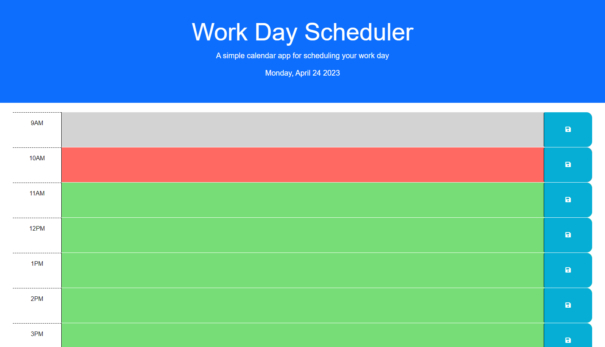

# Web Development Quiz

## Author

Devin Nunez

Email: devv-nunn@gmail.com

git: https://github.com/devv-nunn

## Description

In this project we will focus on making a daily planner for the days that seem super busy. This daily planner is equipt with a feature that changes the time slots based on whether the time slot is is in the past, future, or at the current hour. This ui is helpful for our users to get an idea of where they are in terms of time of the day and tasks left to do. 

-In this project we learned the implementation of local storage for data storage and retrieval and bootstrap of various ui styling.

## Table of Contents
N/a

## Installation

- Nothing needed be installed other than vs code to run application.

- Clone the following repository and run index.html.

## Usage

To use this daily planner just type your task into one of the time slots. Color of time slots will already be sorting based of current time and time of the task slot.

local storage will store that data for later retrieval on page reset.

## Deployment

Repo: https://github.com/devv-nunn/RandomQuestionGen

GitPage: https://devv-nunn.github.io/RandomQuestionGen/

# Tech Stack

- HTML 
- CSS
- JavaScript
- JQuery

## Credits

N/a

## License

MIT License.